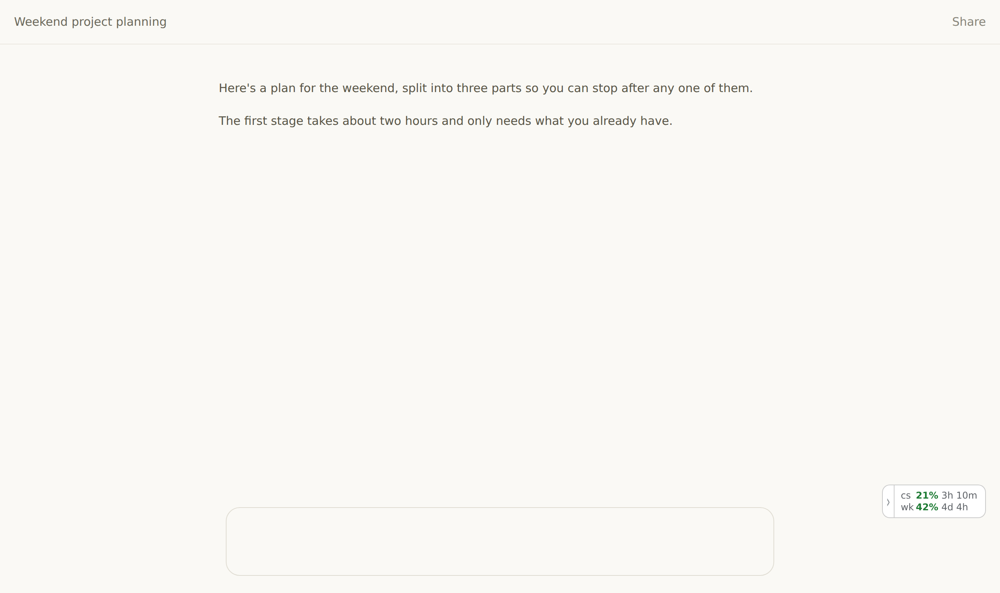
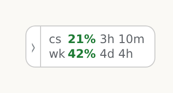
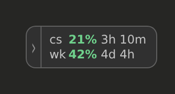
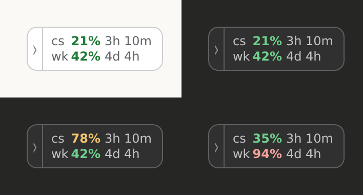
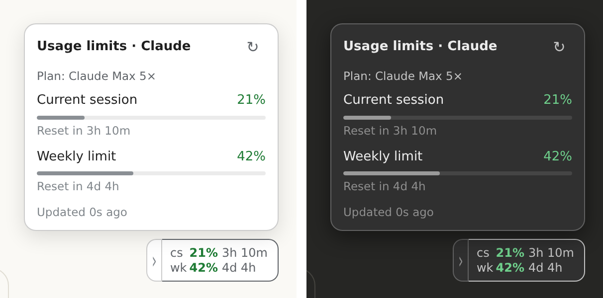
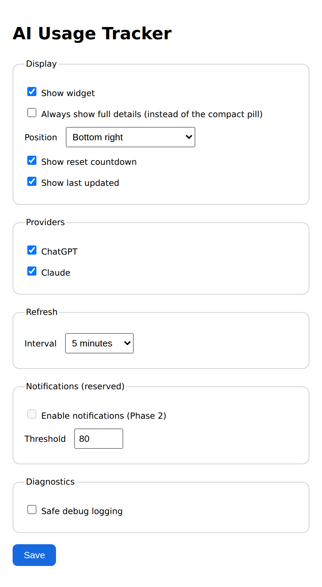
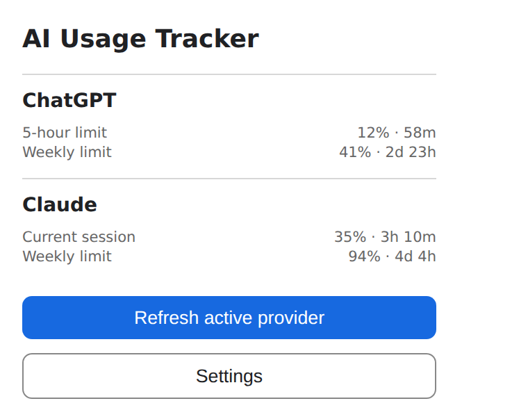

# AI Usage Tracker

See your Claude and ChatGPT usage limits on the page, without opening Settings → Usage.

A small widget sits in the corner of claude.ai and chatgpt.com showing how much of each limit you have used and when it resets. The numbers are green below 70%, amber from 70%, red from 90%, so it stays quiet until a limit is close.



## What it looks like

| | |
| --- | --- |
|  |  |

`cs` is your current session and `wk` your weekly limit on Claude; ChatGPT shows `5h` and `wk`. Each row carries its own reset countdown.



Hover the widget for the full details card, with your plan, both limits and their reset times. The arrow on the left folds it down to a small tab, and that choice is remembered.



## Features

- Both limits and their reset times, always visible, on every page of both sites
- Colour only where it matters: the percentages, not the whole widget
- Follows each site's own light or dark theme, even when it differs from your system setting
- Refreshes on its own while the tab is visible; hidden tabs make no requests
- Fades out of the way while the page scrolls
- Collapses to a tab with one click
- Toolbar popup showing both providers at once
- Options for position, refresh interval, which providers to show, and whether to show reset countdowns

## Install

### From a release

1. Download the latest `.zip` from [Releases](../../releases) and unzip it.
2. Open `chrome://extensions` and turn on **Developer mode**.
3. Click **Load unpacked** and select the unzipped folder.
4. Open claude.ai or chatgpt.com while signed in.

Works in Chrome, Edge, Brave and other Chromium browsers.

### From source

```bash
npm install
npm run build
```

Then load the `dist/` folder as above.

## Privacy

- Everything stays in your browser. There is no server, no account and no analytics.
- Only normalized plan and quota values are cached, in `chrome.storage.local`.
- No passwords, cookies, session identifiers or refresh tokens are read or stored. ChatGPT's short-lived access token is used inside its own page context for the usage request and is never exposed to extension code, logged or saved.
- No prompts, responses or conversations are read.
- No remote code, CDN scripts, `eval` or `new Function`.

## Permissions

| Permission | Reason |
| --- | --- |
| `storage` | Save your settings and the latest usage values locally. |
| `https://chatgpt.com/*` | Show the widget and read your own usage on ChatGPT. |
| `https://claude.ai/*` | Show the widget and read your own usage on Claude. |

No `cookies`, `webRequest`, `tabs`, `history`, notifications or `<all_urls>` permission.

## Options and popup

| | |
| --- | --- |
|  |  |

## How it works

Both providers calculate your usage themselves and show it on their own Usage page. The extension asks for that same value through your existing signed-in page session and displays it. It is not a token estimator and never turns estimated tokens into a subscription percentage.

Each provider is isolated behind its own strategy, with an internal-API path and a conservative DOM fallback. Providers fail independently: if one breaks, the other keeps working.

## Development

```bash
npm run typecheck
npm test
npm run build
npm run check   # all of the above
```

- `src/content`: site detection, widget lifecycle, SPA recovery
- `src/ui`: the widget (`usage-widget.ts`) and its pure display logic (`widget-model.ts`)
- `src/providers`: provider registry, contracts, strategy orchestration, isolated adapters
- `src/usage`: normalization and the cache-aware refresh service
- `src/storage`: `chrome.storage.local` schema and settings
- `src/background`, `src/popup`, `src/options`: the remaining extension surfaces
- `tests`: parsing, normalization, timestamps, storage and widget logic

See [docs/architecture.md](docs/architecture.md) and the provider notes for [Claude](docs/providers/claude.md) and [ChatGPT](docs/providers/chatgpt.md).

Safe debug logging is opt-in in Options and records only the provider, strategy name, normalized result and failure code.

## Limitations

- The endpoints and page structures behind these numbers are undocumented and can change without notice, which may break a provider until the adapter is updated.
- Claude currently reports a current-session and a weekly limit; additional weekly limits appear automatically if Claude starts reporting them.
- When a provider page is signed out, the widget says so instead of retrying.

## Contributing

Issues and pull requests are welcome. If a provider stops working, the provider notes explain how to capture what changed without copying any personal data.

## Disclaimer

Not affiliated with, endorsed by or sponsored by Anthropic or OpenAI. Claude and ChatGPT are trademarks of their respective owners. The extension reads only your own account's usage, in your own browser.

## License

MIT — see [LICENSE](LICENSE).
