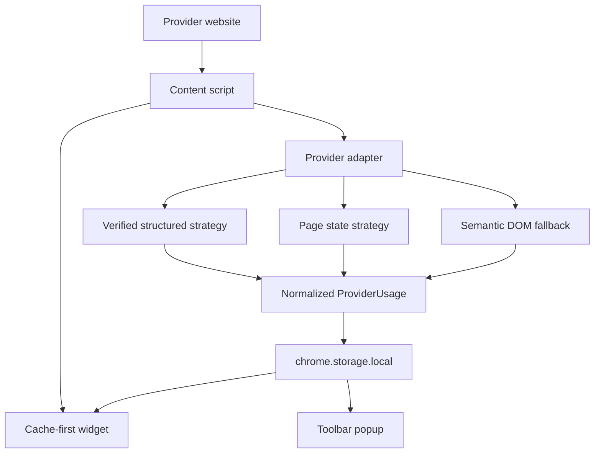

# Architecture

## Trust boundaries

The content script can manipulate the DOM but does not receive secrets. No page-to-extension bridge is enabled yet because no verified provider mechanism requires it. If a MAIN-world bridge becomes necessary, it must use a fixed namespace, accept only validated provider usage payloads, omit headers and request bodies, and never expose Chrome APIs to the page.

## Retrieval flow

1. Detect the exact supported hostname.
2. Render the provider-page widget in its loading state without account-unverified cached values.
3. Force a fresh authenticated request, bypassing the page bridge's short response cache.
4. Run strategies in priority order.
5. Validate and normalize a successful result.
6. Store usage metadata and update the widget; cached snapshots remain available in the toolbar popup.
7. If all strategies fail, show a non-technical error without exposing another account's cached data on the provider page.

## Storage

Settings and each provider's cached usage are stored under separate `chrome.storage.local` keys (`settings`, `usage:chatgpt`, `usage:claude`, plus `schemaVersion`). Independent keys avoid read-modify-write races between tabs. The legacy single-object layout (`aiUsageTracker`) is migrated once on first read. Storage never contains raw responses or authentication material.

## Refresh behavior

The widget fetches fresh data on page load, then refreshes on the configured interval while the tab is visible. Hidden tabs do not poll; returning to a tab refreshes it if the interval has elapsed. Relative times ("Reset in…", "Updated…") update every 30 seconds without re-rendering the widget. The page bridges answer every request: repeated manual refreshes within 5 seconds, or unforced requests within 30 seconds, reuse the latest response.

## Widget design

The widget rests at the top center of the window as a compact pill. It sits centred in the site's top row on every page, except ChatGPT's home page, where it is parked at a fixed spot left of centre to clear the Chat/Cowork switcher. Both spots are fixed: the pill inspects nothing on the page and never shifts around. The pill keeps one size on every page. An arrow button beside it minimizes the widget to a small tab in the corner (colored if a limit is high) and restores it; that choice is saved.  Where no solid bar sits behind it (ChatGPT's chat view scrolls page text under the top row), it dims while the page scrolls and returns when scrolling stops; hovering always restores it. The pill stays hidden until its first placement and until real numbers arrive, so it never appears in one spot and then moves. It shows every limit with its reset time, for example `5h 21% · 3h 12m | wk 42% · 4d 6h`. Only the percentage numbers are colored: green below 70%, amber from 70%, and red from 90%; labels, reset times, and the pill outline stay neutral. Turning off "Show reset countdown" removes the times from the pill and card. Hovering or keyboard-focusing the pill opens the details card (below the pill for top positions, above it for bottom positions) with the plan and every reset countdown; clicking pins it open, and Escape closes it. The pill drops reset times below 900px viewport width (limits stay visible) and follows the site's own light/dark theme by reading the page background. Background refreshes never animate. "Always show full details" in Options keeps the card permanently visible.

## SPA behavior

One widget is mounted per frame. A debounced MutationObserver watches only the direct children of `<html>` to re-attach the host if it is removed. History-driven route changes do not duplicate the widget.

## Future endpoint adapter

A verified adapter should own its URL, method, request mechanism, response schema guard, parser, and sanitized fixture within the provider folder. Same-origin calls should use `credentials: "include"` without reading cookies. Unknown response shapes must raise `RESPONSE_FORMAT_CHANGED` rather than guessing.
